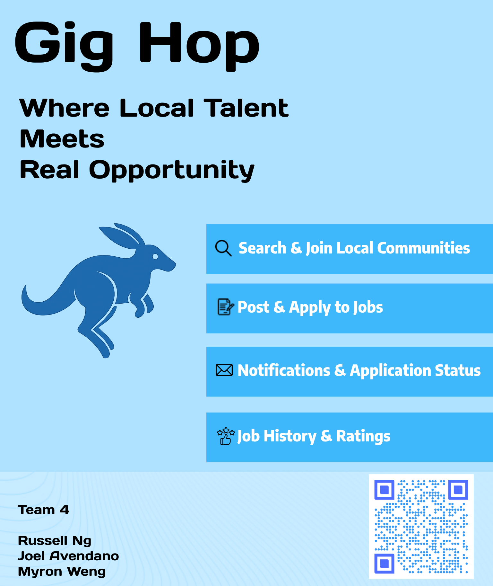

# TEAM 4

## Gig Hop

## Team members

|  |  |  |
|---|---|---|
| **Russell Ng** - Scrum Master| **Joel Avendano** | **Myron Weng** - Product Owner|

## App description

## Idea Proposal
[Idea Proposal](https://docs.google.com/document/d/1-cGwHh7EBxKc1_fBkEbRlidRNIYoMaKz/edit?usp=sharing&ouid=109530987988976320409&rtpof=true&sd=true)

## Calendar
[Calendar](https://calendar.google.com/calendar/u/0?cid=aXZoMmU3NjhzMjRkdGlxZWYwcXZvbzhxcjBAZ3JvdXAuY2FsZW5kYXIuZ29vZ2xlLmNvbQ)

## Product Backlog
[Requirements Discovery](https://docs.google.com/document/d/1dGmEFJ2TbkrRRJC1VEGSTD0ioyp_gakQRmK11PeA46I/edit?usp=sharing)

[Product Backlog Validation](https://docs.google.com/document/d/16Jmh0t4OhNSVGevsdnWJ6ptjIhRSr09SVP3ZZZyOa0o/edit?usp=sharing)

[Product Backlog](https://docs.google.com/spreadsheets/d/1jzOQEqtOU6XXM_vmRGi3yjbNcCunJiUf9Ptom7j_Zew/edit?usp=sharing)
## Architecture & Design
[Architecture & Design](https://docs.google.com/document/d/1k-XGUhECMV3y_P04J2zxacRSCfAFjJ377ALLKVtha0Y/edit?usp=sharing)

## Process

### Sprint 1

* [Sprint planning](https://docs.google.com/document/d/1pIo1VfpP6tdMh5tm3UEWvfP69O-cJn-V3Oq3KsyrwPE/edit?usp=sharing)
* [Scrums](https://docs.google.com/document/d/1aefSBA2preYLBhGeWsR7GboiVGVu4ynrU4MTBA-kozk/edit?usp=sharing)
* [Sprint demo video](https://www.youtube.com/watch?v=9E5i4Ideg0Y)
* [Sprint retrospective](https://docs.google.com/document/d/1xjruq3vwAMckjy3PlFYbafbBZWTU_D_c9KqNa-IZPIQ/edit?usp=sharing)

### Sprint 2

* [Sprint planning](https://docs.google.com/document/d/1vaLmSO7CyvWm5JDJCjV-7mzmGJ5J7HOpKo2rCfAPe2o/edit?usp=sharing)
* [Scrums](https://docs.google.com/document/d/1_yO22Ph4nmu2p_Utf3_JhbCm-dS2Z4FrtLT3M_MqP3I/edit?usp=sharing)
* [Sprint demo video](https://www.youtube.com/watch?v=YsL1bTYGZCk)
* [Sprint retrospective](https://docs.google.com/document/d/1RyhWwZb6Lj8OR6voKl8-4CZdUFYZC_74UhBeJpBHGc0/edit?usp=sharing)

### Sprint 3

* [Sprint planning](https://docs.google.com/document/d/1KaS138_hANLL39xjxO549Nv8v9rKefWSs6L5J6GM36A/edit?usp=sharing)
* [Scrums](https://docs.google.com/document/d/10r81R_k1yrqBE3xwWwdRjDTUw4Yq_cd8ZwP5xjssk_U/edit?usp=sharing)
* [Sprint demo video](https://www.youtube.com/watch?v=Joo5vl_XAOo)
* [Sprint retrospective](https://docs.google.com/document/d/1kBFtB7903gt7pus3Yw5rYP1x3OoNczJo4s-DM9jqHUM/edit?usp=sharing)

## Tools & APIs

## Final delivery

* [Final presentation](https://docs.google.com/presentation/d/1plzF5mDRpkrW4R07mwgbt6kWYA6JV3o98_k9kjhi7Zw/edit?usp=sharing)
* [Poster](photo/gighop-poster.png)

